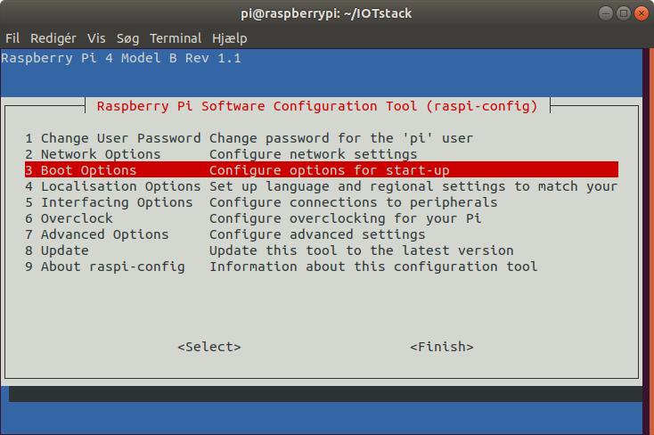
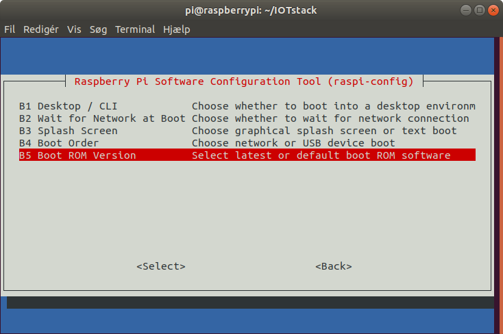

# Raspberry Pi 4, Homeassistant installeret via docker
## Kilder:  
* [#352 Raspberry Pi4 Home Automation Server (incl. Docker, OpenHAB, HASSIO, NextCloud)](https://www.youtube.com/watch?v=KJRMjUzlHI8)
* [#341 Quickie: Raspberry Pi official USB Boot now much simpler. How fast is a cheap SSD?](https://www.youtube.com/watch?v=8vC3D19e_Ac)

## Installer Raspberry Pi Imager
Brug Raspberry Pi Imager til en nem måde at installere Raspberry Pi OS og andre operativsystemer på et SD-kort klar til brug sammen med din Raspberry Pi:

* [Raspberry Pi Imager til Windows](https://downloads.raspberrypi.org/imager/imager_1.4.exe)  
* [Raspberry Pi Imager til macOS](https://downloads.raspberrypi.org/imager/imager_1.4.dmg)
* [Raspberry Pi Imager til Ubuntu](https://downloads.raspberrypi.org/imager/imager_1.4_amd64.deb)  
Installer Raspberry Pi Imager til Raspberry Pi OS ved at køre 
``` sudo apt install rpi-imager ```
i et terminalvindue

## Flash SD kort
* Operating System vælges "Raspberry Pi OS (32-bit)" (Recommended)
* SD Card vælges det du ønsker at boote fra

## Boot Raspberry fra SD-Kort
* Indsætte SD-kortet i din Raspberry PI 
* Forbind nu micro HDMI stikket til en skærm eller TV's HDMI med  [Micro HDMI til HDMI Adapter](https://raspberrypi.dk/produkt/micro-hdmi-til-hdmi-adapter-235mm-hvid/)
* Forbind strømforsyningen og du kan tænde

## Raspberry eeprom update
* Åben et terminal vindue og opdater Raspberry PI OS til nyeste version med disse kommandoer:
```
sudo apt update && sudo apt full-upgrade
```
* Opdater nu eeprommen med denne kommando:
```
sudo rpi-eeprom-update -d -a
```
## Raspberry Config
* Start Raspberry config med denne kommando:

```
sudo raspi-config
```
Udfør nu følgende valg:

* Vælg Boot Option  
  
* Vælg Boot ROM version  

* vælg Latest
* Vælg NO
* Vælg Boot Order
* Vælg USB Boot
* Vælg OK
* Reboot
* Indsæt USB Disk og behold SD-kort jeg bruger denne adapter til SSD-Disk [USB 3.0 til SATA 6Gb/s adapter - 2,5"/3,5"](https://www.av-cables.dk/usb-3-0-til-sata-adapter/usb-3-0-til-sata-6gb-s-adapter-2-5-3-5.html), da Raspberry Pi ikke kan levere strøm nok til disken, min SSD-Disk er [Kingston A400 240GB SSD SATA](https://www.proconsult.dk/product/hd-sa400s37-240g/kingston-a400-240gb-ssd-sata)
* Vælg fra menu SD Card Copy, og kopi SD-Kort til SSD-Disk 
* Sluk din Raspberry Pi når kopieringen er slut
* Fjern SD-Kort og Boot nu fra SSD-Disk


