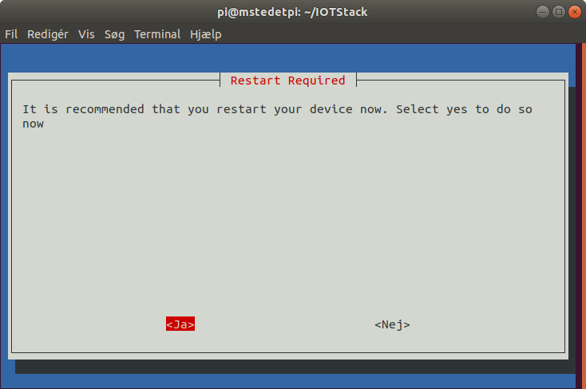

# Raspberry Pi OS med IOTStack 

Installer før installationen af Home Assistant følgende hjælpeprogrammer:
```
sudo apt install network-manager apparmor-utils
```

## 1. Clone IOTStack projected til din Raspberry
```
git clone https://github.com/SensorsIot/IOTstack.git ~/IOTStack
```
## 2. Install Docker
* Start IOTstack menu med denne kommando:
```
cd ~/IOTStack && bash ./menu.sh
```
* Vælg Install Docker  

* Afslut med at vælge <O.k.>  

reboot når du bliver spurt

## 3. Build Stack 
* Vælg Build Stack  

* Vælg følgende Container som vist og afslut med at vælge <O.k.>  


## 4. Install Home Assistant
* Vælg Install Home Assistant (Requires Docker)  
  

## 5. Start IOTstack
Start nu Docker med kommandoen herunder:
``` 
cd ~/IOTStack && docker-compose up -d


``` 